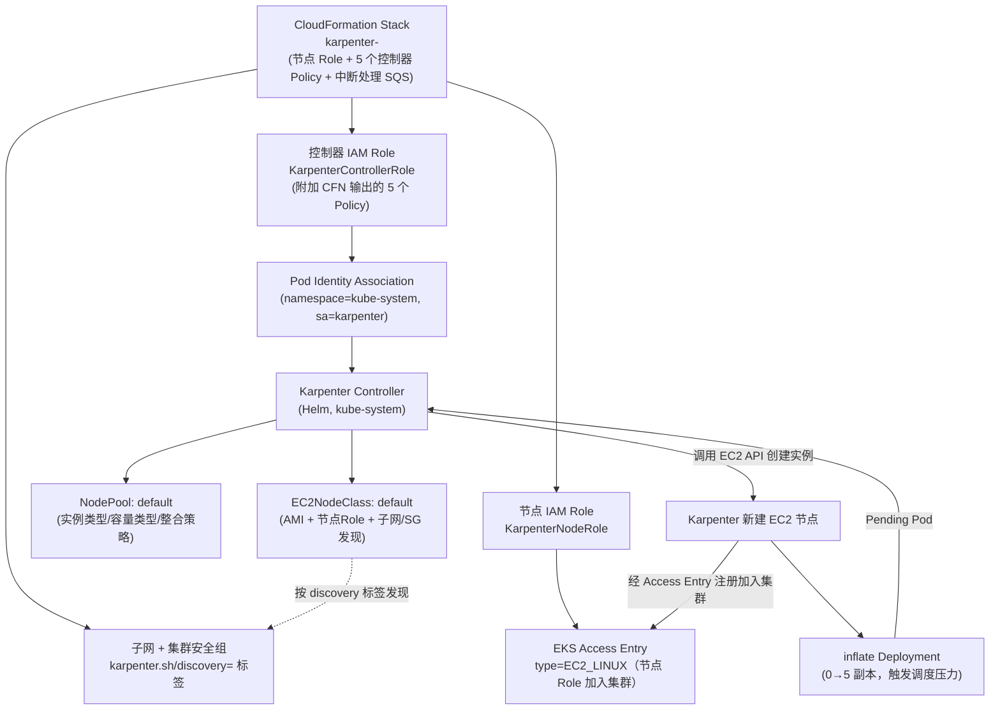
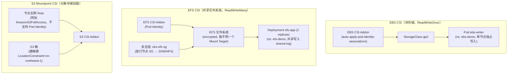
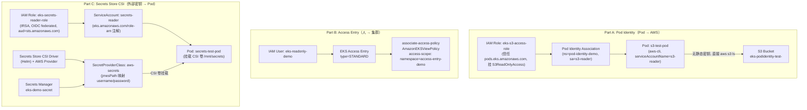
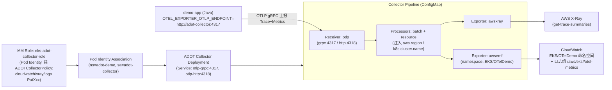

# 架构文档

本仓库包含 18 个 Demo，这里不做全量架构图汇总，只对其中组件交互较复杂、值得可视化的 Demo 提供架构图；其余 Demo 请直接看对应的 `docs/demoXX-*.md`。

以下 3 个 Demo 涉及多组件编排（CloudFormation + IAM + Kubernetes 声明式资源联动）或跨服务遥测管道，复杂度明显高于其余以"安装单个组件 + 验证"为主的 Demo，因此单独画图：

- **Demo09 — Karpenter 节点自动伸缩**：CloudFormation 基础设施 + 发现标签 + Pod Identity 授权 + NodePool/EC2NodeClass 声明式供给的完整安装与扩容链路
- **Demo11 — CSI 有状态存储（EBS/EFS/S3）**：三种 CSI 驱动各自不同的授权模型（Pod Identity vs 节点 Role）与访问模式（RWO vs RWX），叠加中国区 NFS 安全组与建桶 LocationConstraint 约束
- **Demo12 — 身份与访问控制**：Pod Identity（Pod→AWS）、Access Entry（人→集群）、Secrets Store CSI（外部密钥→Pod）三条独立授权路径
- **Demo18 — ADOT 与 OpenTelemetry 可观测性**：应用经 OTLP 上报 Collector，再分管道导出到 X-Ray 与 CloudWatch 的遥测管道

---

## Demo09 — Karpenter 节点自动伸缩

Karpenter 直接调用 EC2 API 按需选择实例类型，比 Cluster Autoscaler 更快更省。安装链路涉及 CloudFormation 建 IAM 资源、子网/安全组发现标签、控制器 Pod Identity 授权、节点 Role 的 Access Entry 注册，最后由 NodePool + EC2NodeClass 声明式定义可供给的节点规格。

---

## Demo11 — CSI 有状态存储（EBS/EFS/S3）

三种 CSI 驱动的授权模型不同：EBS 用托管 addon 自动配置 Pod Identity；EFS 也走 Pod Identity，但节点还需 NFS(2049) 安全组放行 + 挂载目标；S3 Mountpoint 不支持 Pod Identity，权限须直接挂到节点实例 Role。中国区额外约束：EFS/S3 安全组与建桶都要显式处理（S3 建桶需 `LocationConstraint=cn-northwest-1`）。EBS/EFS 两个 addon 与 EFS 文件系统创建可并行触发以节省总耗时。

---

## Demo12 — 身份与访问控制

聚焦中国区 EKS 三种独立的身份与访问控制机制，分别解决三个不同方向的授权问题：

---

## Demo18 — ADOT 与 OpenTelemetry 可观测性

ADOT Collector 以 OpenTelemetry 标准统一接收应用上报的追踪与指标数据，经 batch/resource 处理后分别导出到 X-Ray（追踪）与 CloudWatch EMF（指标），实现云原生应用的端到端可观测性。

---

## 中国区特有约束（适用于以上及其余 Demo）

- **分区与 endpoint**：所有 IAM ARN 使用 `arn:aws-cn:`，ECR/服务 endpoint 使用 `.amazonaws.com.cn`
- **离线优先**：不现场访问 GitHub Release，Helm chart / IAM policy / CLI 二进制均来自仓库内 `offline-assets/` 与 `tools/`
- **镜像固定化**：所有容器镜像统一走 `048912060910.dkr.ecr.cn-northwest-1.amazonaws.com.cn` 的固定 tag，不依赖 Docker Hub/quay.io/registry.k8s.io/ghcr.io
- **公网入口用 8080**：规避中国区域名备案对 80/443 端口的限制
- **配额前置检查**：Karpenter、Prometheus/Grafana、CloudWatch、ADOT、Fargate 等资源密集型 Demo 执行前需先确认 EC2 vCPU、ALB、EIP、Fargate、Spot 配额与容量
